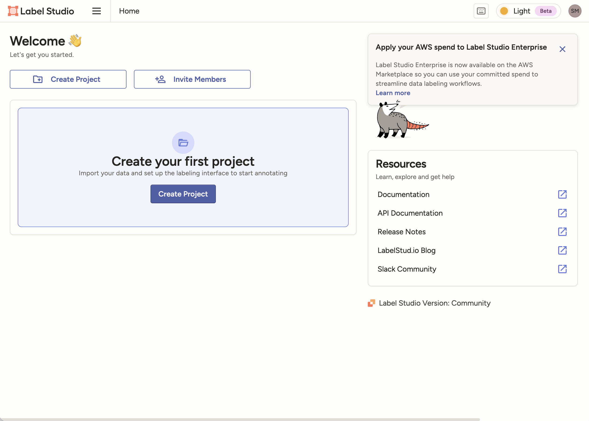

# 🏷️ Label Studio Enterprise AMP for Cloudera AI

This **Applied ML Prototype (AMP)** provides a professional, fully automated solution for deploying **Label Studio** within Cloudera AI (CML). It is specifically engineered to bypass standard networking limitations and dependency conflicts common in containerized Enterprise AI environments.

---

## 🚀 Overview

Deploying Label Studio in Cloudera AI presents specific technical challenges that this AMP solves out-of-the-box:

1.  **Network Conflict Resolution:** Standard Django-based applications attempt to bind to `0.0.0.0:[Port]`. In CML, the Application Proxy often occupies this interface, leading to "Address already in use" errors. This script forces a **Loopback Bind (127.0.0.1)** to safely tunnel traffic through the CML ingress.
2.  **Environment Isolation:** To prevent dependency conflicts with the CML Runtime libraries, the script automates the creation of an isolated **Virtual Environment (venv)** using Python 3.10.
3.  **Security Integration:** Automated injection of `CSRF_TRUSTED_ORIGINS` ensures the CML-generated URL is recognized as a secure origin, preventing the common `403 Forbidden` error after login.

---

## 📸 Final Project Structure

Once the AMP is deployed, your project environment will be automatically configured with the necessary isolated environments and persistent data folders.

---

## 🛠️ Infrastructure Requirements

To ensure a smooth experience and a responsive labeling interface, the following resource allocation is pre-configured in the AMP metadata:

| Resource | Requirement |
| :--- | :--- |
| **Runtime** | Python 3.10 (Jupyter Engine) |
| **vCPU** | 4 Cores |
| **RAM** | 8 GB |
| **Storage** | Persistent Volume (Project Home) |

---

## 📥 Installation & Deployment

This AMP automates the deployment via the `.project-metadata.yaml` file. 

### 1. Automated Deployment
1.  Navigate to **"Applied ML Prototypes"** in your CML Workspace.
2.  Click **"New Project"** and paste this Repository URL.
3.  CML will automatically trigger the `launch.py` script to build the environment.

### 2. Manual Application Verification
If you need to verify or restart the service, navigate to the **"Applications"** tab. The setup should look like this:

> **Note on First Launch:** The initial deployment takes approximately **15-20 minutes** as it builds the virtual environment and installs high-fidelity labeling libraries. Subsequent starts are near-instant.

---

## 🔑 Initial Access & Setup

Once the application status changes to **"Running"**, click the generated URL to access the platform.

### User Creation
1.  On the login screen, click **"Sign Up"** or **"Create Account"**.
2.  Register your email and password.
3.  **Data Persistence:** All projects and annotations are stored in the `/label_studio_data` folder. This folder is preserved even if the application or the session is restarted.

---

## ⚙️ Technical Features

* **Django Management Tunneling:** Directly utilizes `manage.py runserver` for granular network control.
* **Auto-Migration:** Automatically initializes the SQLite database schema on the first run within the venv.
* **CSRF Shield:** Dynamic detection of the `CDSW_DOMAIN` to whitelist the environment's URL on the fly.
* **Process Cleanup:** Built-in routine to identify and terminate stale instances before launching, ensuring the port is always available.

---